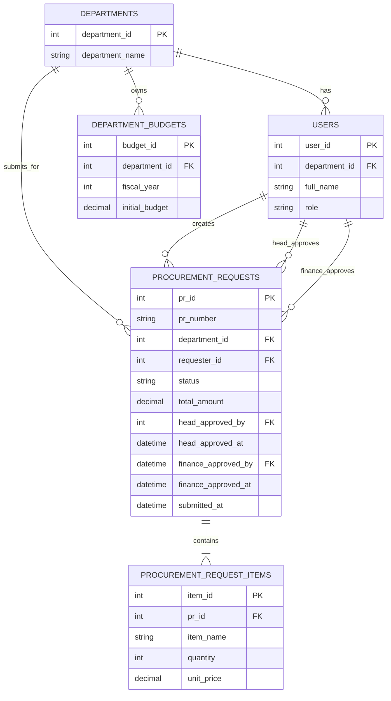
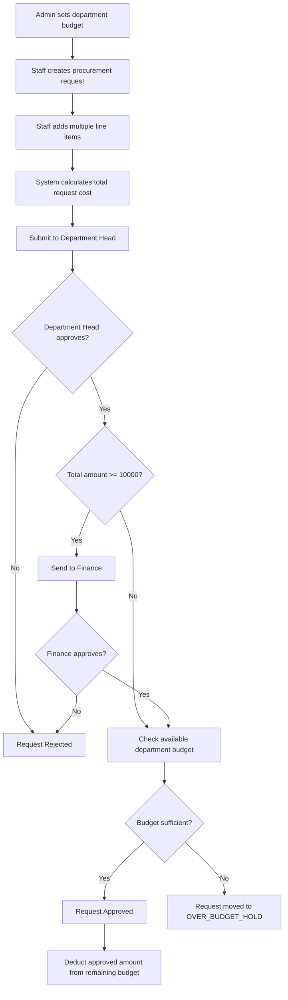
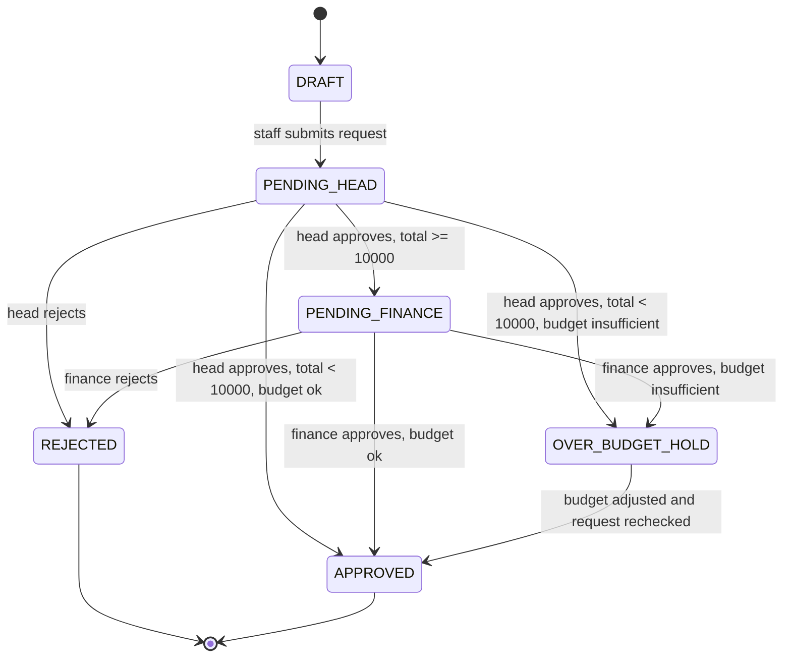

# Integrated Procurement and Budget Control System

## Overview
This repository is an interview-ready system analysis submission for an Integrated Procurement and Budget Control System built with a low-code mindset. The design focuses on simple data structures, clear approval routing, and strict budget control so the solution is easy to explain in a demo video or interview discussion.

## Assumptions
- The currently accessible repository only contained a placeholder `README.md`, so this submission rebuilds the design from scratch.
- One department has one active budget record per fiscal year.
- Each user belongs to one department and acts in one main role: `ADMIN`, `STAFF`, `DEPARTMENT_HEAD`, or `FINANCE`.
- Each procurement request belongs to one department and one requester.
- A procurement request can contain many line items.
- `total_amount` is stored on the request header for simple routing and reporting, but it must always equal the sum of all line items.
- Remaining budget is not stored as a separate field. It is calculated as `initial_budget - sum(APPROVED procurement requests)`.
- Only `APPROVED` requests reduce the available budget.
- `OVER_BUDGET_HOLD` means the request is valid from a workflow perspective but cannot be finalized until budget is adjusted or the request is closed.

## ERD

## Workflow Diagram

## PR State Machine

## My Approach
I started from the business rules instead of from technical features. The design uses a small number of entities, a status-driven workflow, and one clear budget formula so the solution stays presentation-friendly.

This is intentionally designed for a low-code platform. In practice, the platform would use:
- data tables for master and transaction records
- forms for request entry
- approval workflows for Department Head and Finance routing
- dashboard cards and filtered views for budget monitoring

## System Modules
### 1. Department Budget Administration
Admin users create and maintain the initial budget for each department and fiscal year. This module is the budget control source for approval checks and dashboard reporting.

### 2. Procurement Request Submission
Staff users create a procurement request, add multiple line items, and submit the request for approval. The header total is the sum of all item lines.

### 3. Department Head Approval
Every submitted request goes first to the Department Head. This keeps departmental ownership strong before Finance gets involved.

### 4. Finance Approval
Finance only reviews requests where `total_amount >= 10000`. This keeps the flow simple and matches the stated approval threshold.

### 5. Budget Control and Monitoring
Before final approval, the system checks remaining budget. If enough budget exists, the request is approved. If not, the request moves to `OVER_BUDGET_HOLD`.

## Key Business Logic
1. Admin sets the initial budget for a department.
2. Staff creates a procurement request with one or more line items.
3. Each line item amount is `quantity x unit_price`.
4. Total request cost is the sum of all line item amounts.
5. Department Head approval is always required first.
6. If `total_amount < 10000`, the request can move directly to budget checking after Department Head approval.
7. If `total_amount >= 10000`, Finance approval is required after Department Head approval.
8. Budget is checked only before final approval.
9. If budget is insufficient, the request status becomes `OVER_BUDGET_HOLD`.
10. If budget is sufficient, the request status becomes `APPROVED`.
11. Remaining budget is calculated as `initial_budget - approved request totals`.
12. Only approved requests reduce the remaining budget.

## Wireframes
### Dashboard Screen
The dashboard should show high-level budget control first. A simple layout should include:
- total initial budget by department
- approved spend
- remaining budget
- count of requests pending Department Head approval
- count of requests pending Finance approval
- count of requests on over-budget hold
- a table of recent procurement requests with status badges

### Procurement Request Form
The request form should have:
- request header with department, requester, and submission date
- repeating line item grid
- quantity and unit price fields for each item
- live total amount display
- submit button that changes status from `DRAFT` to `PENDING_HEAD`

### Approval Screen
The approval screen should show:
- request summary
- full line item breakdown
- total amount
- current budget snapshot for the department
- approve and reject actions
- clear status history or approval timestamps

### Budget Maintenance Screen
The budget screen should show:
- department
- fiscal year
- initial budget value
- approved spend to date
- remaining budget

## Dashboard Explanation
The dashboard works because it answers the three questions managers care about most:

1. How much budget was allocated?
2. How much budget is already committed through approved requests?
3. Which requests need action right now?

For a demo, the most useful KPI formulas are:
- Approved Spend = sum of `total_amount` where status is `APPROVED`
- Remaining Budget = `initial_budget - approved spend`
- Pending Head Queue = count of requests in `PENDING_HEAD`
- Pending Finance Queue = count of requests in `PENDING_FINANCE`
- Over Budget Hold Queue = count of requests in `OVER_BUDGET_HOLD`

## Edge Cases
- A request with total exactly `10000` must go to Finance because the rule is `>= 10000`.
- A request on `OVER_BUDGET_HOLD` does not consume budget yet.
- A rejected request does not consume budget.
- If a department has no budget record for the active year, the final budget check should fail and the request should move to `OVER_BUDGET_HOLD`.
- If line items change, `total_amount` must be recalculated before approval routing is decided.
- Budget must be checked again at final approval time to avoid approving against outdated available budget.

## Code Explanation
### Tables
| Table | Purpose |
| --- | --- |
| `departments` | Master list of departments that own budgets and submit requests. |
| `users` | Staff, Department Head, Finance, and Admin users. |
| `department_budgets` | Stores the initial budget for each department and fiscal year. |
| `procurement_requests` | Stores the request header, workflow status, total amount, and approval details. |
| `procurement_request_items` | Stores the individual line items inside each procurement request. |

### Relationships
| Relationship | Meaning |
| --- | --- |
| `departments -> users` | A department has many users. |
| `departments -> department_budgets` | A department can have budget records across fiscal years. |
| `departments -> procurement_requests` | Requests belong to a department. |
| `users -> procurement_requests` | A user creates a request. |
| `procurement_requests -> procurement_request_items` | One request can contain many items. |
| `users -> procurement_requests (approval fields)` | Users can act as Department Head or Finance approvers. |

### Logic in Simple Terms
- The request header stores the total amount so routing is easy in a low-code workflow.
- The item table stores the detailed cost breakdown.
- The status field controls the process stage.
- Approval fields store who approved and when.
- The budget table stores only the original amount because remaining budget is a calculated business value.

### Simple Talking Points for Demo
- "This design keeps the database small so the process is easy to audit."
- "The approval path is driven by one threshold only, which makes the rules easy to explain."
- "Budget deduction only happens after final approval, so pending requests do not distort reporting."
- "The dashboard is based on status counts and approved totals, which is very suitable for a low-code app."

## Demo Walkthrough
1. Open the dashboard and explain the three core KPIs: initial budget, approved spend, and remaining budget.
2. Open the budget screen and show that Admin sets the initial budget for a department and year.
3. Open the procurement request form and create a request with multiple line items.
4. Point out that the system calculates the total automatically from quantity and unit price.
5. Submit the request and show that it moves to `PENDING_HEAD`.
6. Approve it as Department Head.
7. If the total is below `10000`, explain that the next step is the budget check.
8. If the total is `10000` or more, explain that the request goes to Finance first.
9. Show one example that becomes `APPROVED` and explain that only then does it reduce the remaining budget.
10. Show one example that becomes `OVER_BUDGET_HOLD` and explain that it is blocked because the remaining budget is not enough.
11. Return to the dashboard and show how the counts and budget figures reflect the request outcomes.

## Why This Design Works
This design works because it matches the problem statement directly without adding unnecessary complexity. The ERD is small, the workflow is readable, and the state machine is easy to narrate. That makes the solution strong for both implementation and interview presentation.

The README is the source of truth for this repository. The SQL files in `/sql` are intentionally simple and follow this design exactly.
