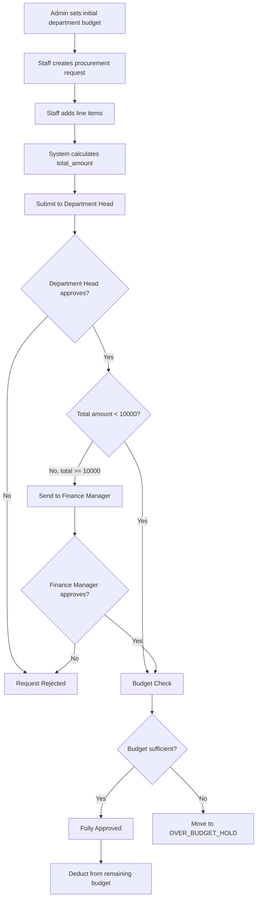
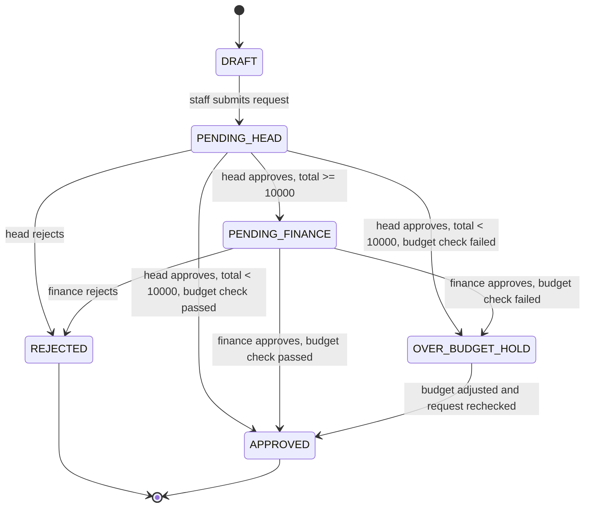

# Integrated Procurement and Budget Control System

## Overview
This repository is a final technical test submission for an Integrated Procurement and Budget Control System designed with a low-code mindset. The solution keeps the data model small, the approval flow easy to explain, and the budget control logic explicit so it is suitable for both implementation and interview presentation.

## Repository Structure
- `README.md`: Main Functional Specification Document. It contains the system overview, assumptions, diagrams, workflow, business logic, wireframe descriptions, demo walkthrough, presentation script, and quick answer lines.
- `sql/schema.sql`: Database schema for the proof of concept. The tables, relationships, and status values are aligned with the ERD and state model in the README.
- `sql/seed.sql`: Sample data for the demo scenarios. It supports the walkthrough examples for `PR-2026-001`, `PR-2026-002`, `PR-2026-003`, and `PR-2026-004`.

## Technical Test Coverage
### FSD (Functional Specification Document)
- ERD: Included in this README as a Mermaid diagram.
- Workflow Diagram: Included in this README as a Mermaid diagram.
- Business Logic: Explained in this README with approval rules, budget rules, and status behavior.
- Wireframes: Described in this README in simple business-friendly terms.

### POC (Proof of Concept)
- Data model: Implemented in `sql/schema.sql`.
- Relationships: Match the ERD in the README.
- Calculation logic: Supports `total_amount` on the request header and the remaining budget formula based on approved requests.
- Conditional workflow: Supports the two approval paths for `<10000` and `>=10000` using the request header total, workflow rules, and status model.

### Demo / Video
- Demo walkthrough: Included in this README.
Covered scenarios:
- `PR-2026-001` for the `<10000` approval path.
- `PR-2026-002` for the `>=10000` approval path.
- `PR-2026-003` for the over-budget hold case.
- `PR-2026-004` for the pending Department Head case.

## Assumptions
- The accessible repository originally contained only a placeholder `README.md`, so the submission branch holds the actual deliverables.
- One department has one active budget record per fiscal year.
- Each user belongs to one department and acts in one main role: `ADMIN`, `STAFF`, `DEPARTMENT_HEAD`, or `FINANCE`.
- In business terms, the `FINANCE` role represents the Finance Manager approval step.
- Each procurement request belongs to one department and one requester.
- A procurement request can contain many line items.
- `total_amount` is stored on the request header for simple routing and reporting, but it must always equal the sum of all line items.
- Remaining budget is not stored as a separate field. It is calculated from the budget record and approved requests.
- Only `APPROVED` requests reduce the available budget.
- `OVER_BUDGET_HOLD` means the request has passed the approval route so far, but cannot be finalized until budget is available or the request is revised.

## ERD

Master-detail note:
- `procurement_requests` is the master or header table. It stores one row per procurement request, including the department, requester, current status, approval fields, and `total_amount`.
- `procurement_request_items` is the detail table. It stores the line items under each request, where each line amount is `quantity x unit_price`.

Design note:
- `total_amount` is stored in `procurement_requests` so low-code approval routing, dashboard reporting, and budget checking can use one ready value without recalculating all line items every time.

## Workflow Diagram

Workflow rule summary:
- If `total_amount < 10000`: Department Head -> Budget Check -> Fully Approved.
- If `total_amount >= 10000`: Department Head -> Finance Manager -> Budget Check -> Fully Approved.
- The budget check happens before final approval in both paths.
- A PR enters `APPROVED` only after all required approvals are complete and the budget check passes. Budget is deducted only at that point.
- If approving the PR would make the remaining budget negative, the system blocks final approval and sets the PR to `OVER_BUDGET_HOLD`.

## PR State Machine

Status naming note:
- The exact status values are `DRAFT`, `PENDING_HEAD`, `PENDING_FINANCE`, `OVER_BUDGET_HOLD`, `APPROVED`, and `REJECTED`.
- These same status names are used in the state diagram, the README explanations, and the `schema.sql` status constraint.

## My Approach
I started from the business rules instead of from technical features. The design uses a small number of entities, a status-driven workflow, and one clear budget formula so the solution stays presentation-friendly.

This is intentionally designed for a low-code platform. In practice, the platform would use:
- data tables for master and transaction records
- forms for request entry
- approval workflows for Department Head and Finance Manager routing
- dashboard cards and filtered views for budget monitoring

## System Modules
### 1. Department Budget Administration
Admin users create and maintain the initial budget for each department and fiscal year. This module is the budget control source for approval checks and dashboard reporting.

### 2. Procurement Request Submission
Staff users create a procurement request, add multiple line items, and submit the request for approval. The request header stores the overall summary, while the detail lines store the individual purchase items.

### 3. Department Head Approval
Every submitted request goes first to the Department Head. This keeps departmental ownership strong before Finance Manager review is considered.

### 4. Finance Manager Approval
Finance Manager review is only required when `total_amount >= 10000`. In the schema, this step is performed by users with the `FINANCE` role.

### 5. Budget Control and Monitoring
Before final approval, the system checks remaining budget. A PR enters `APPROVED` only after all required approvals are complete and this check passes. If approval would make the remaining budget negative, final approval is blocked and the request moves to `OVER_BUDGET_HOLD`.

## Implementation in Low-Code Terms
The solution can be implemented with standard low-code building blocks instead of custom-heavy code.

- Data layer: the five tables store master data, request headers, and request items.
- Form layer: one form captures the request header and one repeating grid captures line items.
- Rule layer: one rule calculates `total_amount`, one rule routes to Finance Manager when the total is `>= 10000`, and one rule checks budget before final approval.
- Approval layer: role-based actions allow Department Head and Finance Manager users to approve or reject.
- Reporting layer: dashboard cards and filtered lists show budget usage and approval queues.

## Key Business Logic
### Budget Calculation Formula
`Remaining Budget = Initial Budget - SUM(total_amount of APPROVED PRs)`

Only `APPROVED` procurement requests reduce the remaining budget. Budget is deducted only when a PR enters `APPROVED`, after all required approvals and the final budget check have passed.

### Approval Rules
1. Admin sets the initial budget for a department.
2. Staff creates a procurement request with one or more line items.
3. Each line item amount is `quantity x unit_price`.
4. Total request cost is the sum of all line item amounts.
5. Department Head approval is always required first.
6. If `total_amount < 10000`, the request moves from Department Head review to the budget check.
7. If `total_amount >= 10000`, Finance Manager approval is required before the budget check.
8. The budget check always happens before final approval.
9. If all required approvals are complete and budget is sufficient, the request enters `APPROVED`.
10. Budget is deducted only when the request enters `APPROVED`.
11. If approving the request would make the remaining budget negative, final approval is blocked and the request becomes `OVER_BUDGET_HOLD`.

## Wireframes
### Dashboard Screen
The dashboard should show budget control first. A simple layout should include:
- total initial budget by department
- approved spend
- remaining budget
- count of requests pending Department Head approval
- count of requests pending Finance Manager approval
- count of requests on over-budget hold
- a table of recent procurement requests with status badges

### Procurement Request Form
The request form should have:
- request header with department, requester, and submission date
- repeating line item grid
- quantity and unit price fields for each item
- live total amount display
- submit button that changes status from `DRAFT` to `PENDING_HEAD`

### Approval Screen
The approval screen should show:
- request summary from the header record
- full line item breakdown from the detail records
- total amount
- current budget snapshot for the department
- approve and reject actions
- clear approval timestamps

### Budget Maintenance Screen
The budget screen should show:
- department
- fiscal year
- initial budget value
- approved spend to date
- remaining budget

## Dashboard Explanation
The dashboard provides real-time visibility into budget consumption and approval bottlenecks.

This view should answer three business questions quickly:
1. How much budget was allocated?
2. How much budget has already been consumed by approved procurement requests?
3. Which requests are waiting for action or blocked by budget?

Key dashboard measures:
- Approved Spend = `SUM(total_amount)` where status is `APPROVED`
- Remaining Budget = `Initial Budget - SUM(total_amount of APPROVED PRs)`
- Pending Head Queue = count of requests in `PENDING_HEAD`
- Pending Finance Queue = count of requests in `PENDING_FINANCE`
- Over Budget Hold Queue = count of requests in `OVER_BUDGET_HOLD`

## Edge Cases
- A request with total exactly `10000` must go to Finance Manager because the rule is `>= 10000`.
- A request on `OVER_BUDGET_HOLD` does not consume budget yet.
- A rejected request does not consume budget.
- If a department has no budget record for the active year, the final budget check should fail and the request should move to `OVER_BUDGET_HOLD`.
- If line items change, `total_amount` must be recalculated before approval routing is decided.
- Budget must be checked again at final approval time to avoid approving against outdated available budget.

## Code Explanation
### Tables
- `departments`: This table stores the department master data.
- `users`: This table stores the people who create requests or approve them.
- `department_budgets`: This table stores the initial budget for each department and fiscal year.
- `procurement_requests`: This table stores the procurement request header, including status, requester, approval fields, and `total_amount`.
- `procurement_request_items`: This table stores the detail line items that belong to each procurement request.

### Relationships
- `departments -> users`: This relationship allows each department to have its own staff and approvers.
- `departments -> department_budgets`: This relationship allows each department to hold a budget record for each fiscal year.
- `departments -> procurement_requests`: This relationship allows each request to be tied back to the department that owns the budget.
- `users -> procurement_requests`: This relationship allows the system to record who submitted each request.
- `procurement_requests -> procurement_request_items`: This relationship allows one request header to contain many detail line items.
- `users -> procurement_requests (approval fields)`: This relationship allows the system to record who approved the request and when.

### Logic in Simple Terms
- `procurement_requests` is the master record and `procurement_request_items` is the detail record.
- `total_amount` is stored on the header so low-code routing and reporting stay simple.
- The status field controls where the request is in the process.
- The approval fields show who approved the request and when.
- The budget table stores the starting budget, while remaining budget is calculated from approved requests.

### Simple Talking Points for Demo
- "This table stores the request header, while the item table stores the line items underneath it."
- "This relationship allows one procurement request to contain many purchase items."
- "The stored total amount makes low-code approval routing and dashboard reporting simpler."
- "Budget is only reduced after full approval, so pending or blocked requests do not distort the numbers."

## Demo Walkthrough
The seed data supports three main demo cases and one pending queue example.

1. Start on the dashboard and show the Information Technology department figures: initial budget `50000.00`, approved spend `17000.00`, and remaining budget `33000.00`.
2. Case 1: Open `PR-2026-001` with total `4500.00`. Explain that this is the `<10000` scenario, so it follows `Department Head -> Budget Check -> APPROVED`.
3. Point out that Finance Manager approval is not needed for `PR-2026-001` because the total is below `10000`.
4. Case 2: Open `PR-2026-002` with total `12500.00`. Explain that this is the `>=10000` scenario, so it follows `Department Head -> Finance Manager -> Budget Check -> APPROVED`.
5. Emphasize that budget is deducted only when a PR enters `APPROVED`, which is why approved spend is based on `PR-2026-001` and `PR-2026-002` only.
6. Case 3: Open `PR-2026-003` with total `40000.00`. Explain that it passed Department Head approval and Finance Manager approval, but the system blocked final approval because approving it would push the remaining budget below zero.
7. Show that `PR-2026-003` is therefore placed in `OVER_BUDGET_HOLD` instead of `APPROVED`.
8. Optional queue example: Open `PR-2026-004` to show a request still waiting in `PENDING_HEAD`.
9. Return to the dashboard and explain how the approved, pending, and over-budget figures match the seed data and workflow design.

## Presentation Script
### 1. Introduction
"Hi, in this video I’m presenting my Integrated Procurement and Budget Control System. The purpose of this solution is to help a department control purchasing requests while making sure spending stays within budget. The system solves two business problems at the same time: approval routing and budget control."

### 2. ERD Explanation
"I’ll start with the data model. The main entities are departments, users, department budgets, procurement requests, and procurement request items. The most important structure here is the master-detail design. `procurement_requests` is the header or master table, and it stores one request record with the requester, department, status, approval fields, and total amount. `procurement_request_items` is the detail table, and it stores the line items under that request. This keeps the design simple and very suitable for a low-code platform."

### 3. Workflow Explanation
"Next, I’ll explain the workflow. Every request starts with the Department Head. After that, the process splits into two paths. If the total amount is below 10,000, the request goes from Department Head review straight to the budget check. If the total amount is 10,000 or more, it must go to the Finance Manager first, and then to the budget check. Budget is deducted only after final approval, not before. So a request only affects the remaining budget when it enters the `APPROVED` state. If approving the request would make the remaining budget negative, the system blocks final approval and moves the request to `OVER_BUDGET_HOLD`."

### 4. Budget Logic Explanation
"The budget formula is very direct. Remaining Budget equals Initial Budget minus the sum of total amounts from approved procurement requests. In plain English, that means only approved requests reduce the budget. Draft requests, pending requests, rejected requests, and over-budget hold requests do not reduce the available balance."

### 5. Dashboard Explanation
"The dashboard gives real-time visibility into budget consumption and approval bottlenecks. It shows the initial budget, approved spend, remaining budget, and the number of requests waiting at each stage. This is useful for Admin and Finance because they can see both financial exposure and operational delays in one place."

### 6. Demo Walkthrough
"For the demo, I use the seed data to show four scenarios. First, `PR-2026-001` has a total of 4,500, so it follows the below-10,000 path. It goes from Department Head approval to the budget check, and then it becomes `APPROVED`. Because it is approved, it contributes to approved spend. Second, `PR-2026-002` has a total of 12,500, so it follows the 10,000-or-more path. It goes to the Department Head, then to the Finance Manager, then to the budget check, and then it becomes `APPROVED`. Third, `PR-2026-003` has a total of 40,000. It passes the approval route, but it would push the remaining budget below zero, so final approval is blocked and the request moves to `OVER_BUDGET_HOLD`. That means it does not reduce the budget. Finally, `PR-2026-004` shows a request still waiting at the `PENDING_HEAD` stage. On the dashboard, I can then show that the Information Technology department started with 50,000, has 17,000 in approved spend from the two approved requests, and has 33,000 remaining."

### 7. Code / SQL Explanation
"If I look at the SQL, `schema.sql` defines the five core tables that support the design. `departments` stores the department list, `users` stores the people and their roles, `department_budgets` stores the initial budget, `procurement_requests` stores the request header, and `procurement_request_items` stores the detail lines. I store `total_amount` on the request header because it makes routing, reporting, and budget checking much easier in a low-code system. Then `seed.sql` adds sample data so I can demonstrate the below-10,000 path, the Finance Manager path, the over-budget hold case, and a pending request."

### 8. Closing
"To close, I think this design is strong because it is simple, controlled, and low-code friendly. It is easy to explain, easy to report on, and easy to scale without making the process complicated."

## Quick Answer Lines
- Why did you use a master-detail design?
  Because one procurement request can contain many line items. The header-detail structure keeps the request summary separate from the item breakdown.

- Why store `total_amount` on the request header?
  It makes approval routing, budget checking, and dashboard reporting simpler. The system does not need to recalculate every line item every time.

- When is budget deducted?
  Budget is deducted only when a request enters `APPROVED`, after all required approvals and the final budget check pass.

- What happens if budget is insufficient?
  Final approval is blocked. The request moves to `OVER_BUDGET_HOLD` and does not reduce the remaining budget.

- Why is this suitable for a low-code platform?
  The model is small, the workflow is rule-based, and the reporting logic is straightforward. That makes it easy to build with forms, workflows, and dashboards.

## Why This Design Works
This design works because it matches the technical test requirements directly without adding unnecessary complexity. The ERD is simple, the workflow makes the two approval paths obvious, the state machine uses exact system status values, and the budget formula is explicit.

The README is the source of truth for this repository. The SQL files in `/sql` intentionally mirror the same entities, statuses, and approval logic.
", "encoding": "utf-8", "sha": "efe731790b9a65b9a88c79cd1cc4b1f2de1a2a54", "display_url": "https://github.com/Kishore423/procurement-budget-system/blob/codex/interview-ready-submission/README.md", "display_title": "README.md"}